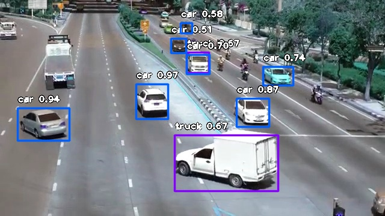
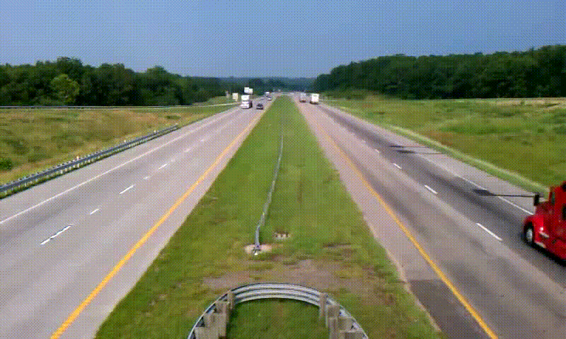
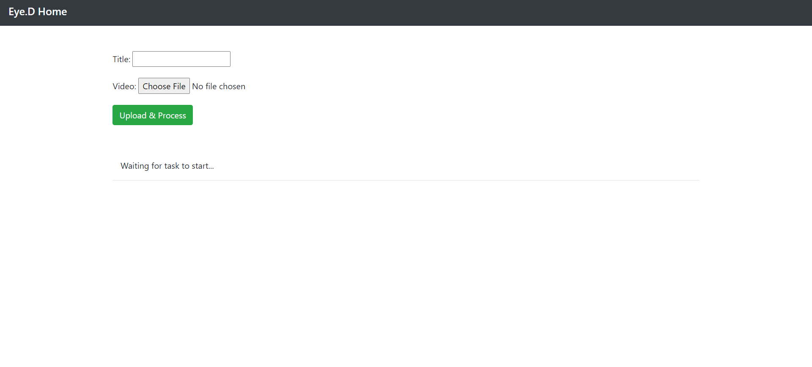
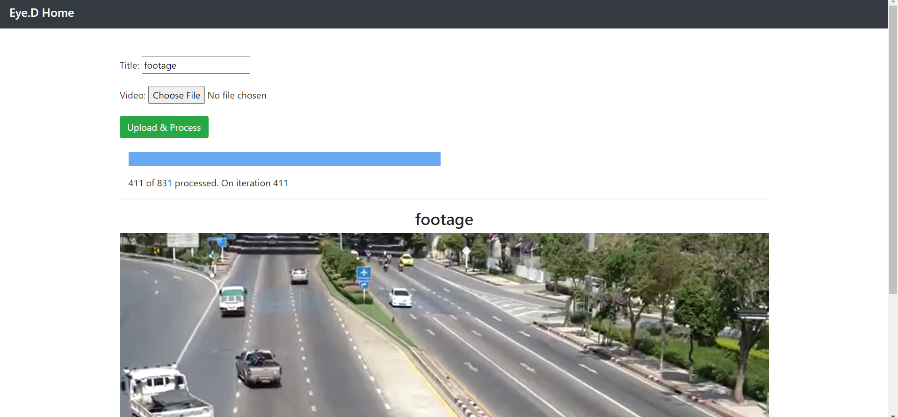
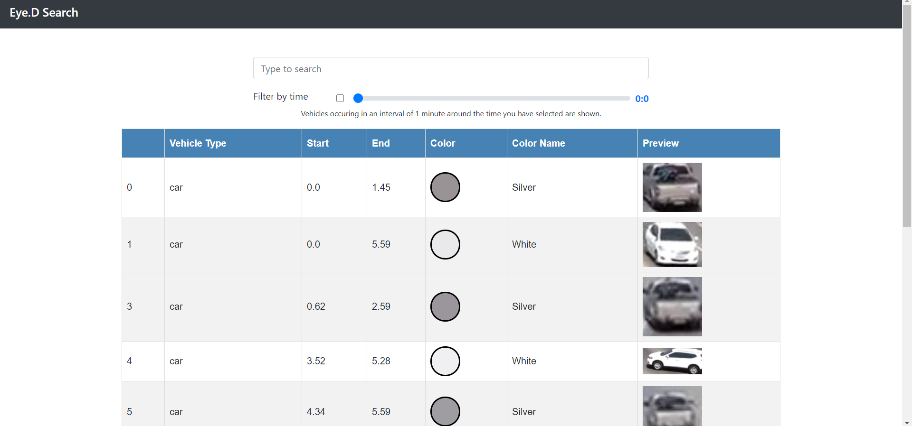
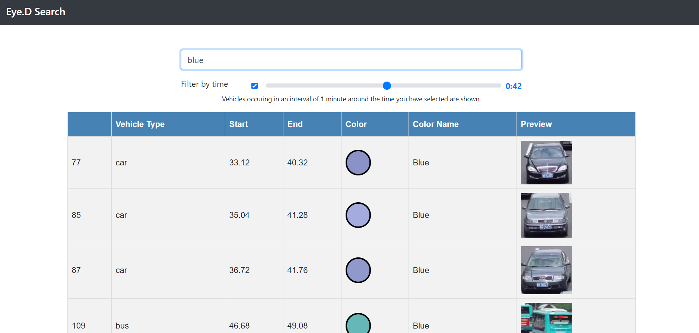
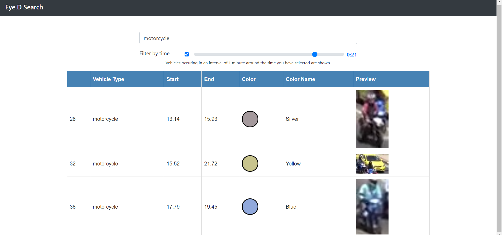
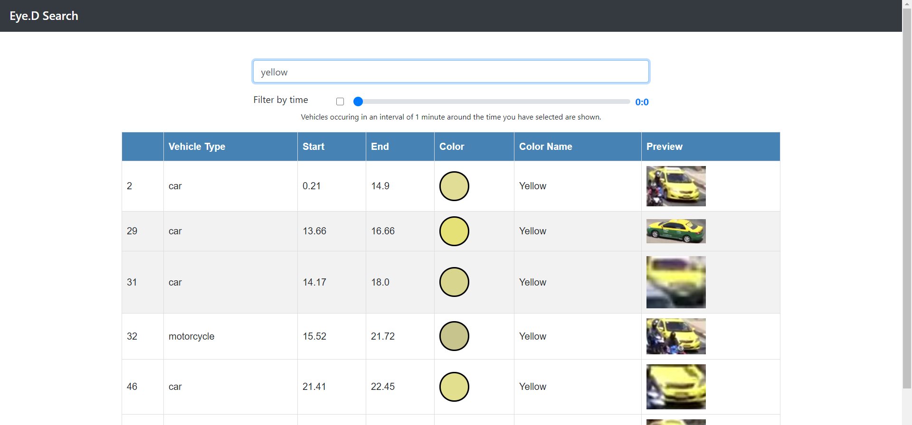
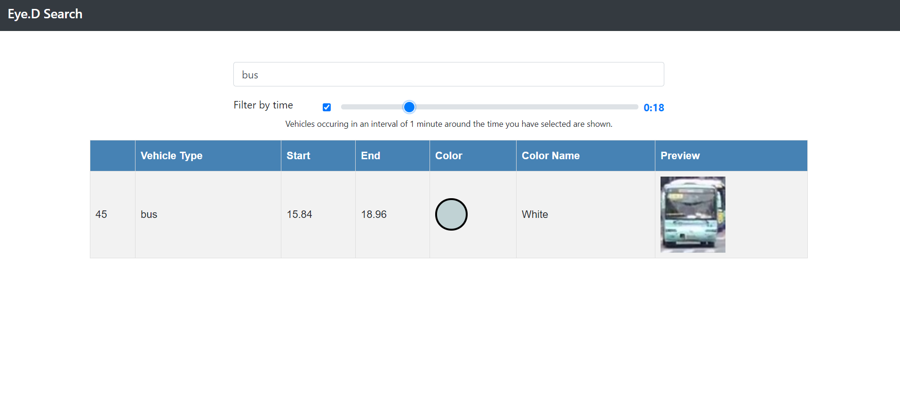

# Eye-dentify

Search for vehicles based on type, color and/or timestamps from several hours of CCTV footage with ease.

## Object Detection

We have used the *imageai* library for implementing the YOLO algorithm to retrieve bounding boxes from the image. The *yolo-tiny* pre-trained model has been used to save computation time. The model is run only for every 3 frames (as it takes approximately 0.5 seconds for each detection when run on CPU). A sample output for a frame is shown below. 

 

## Object Tracking

>Inspired from this [project](https://github.com/eonr/cctv-recap).

The core idea of the object tracking is a version of the centroid tracking algorithm and an implemented version was found from the above project, but it has serious problems as discussed below.

- The version implemented by the cctv-recap project didn't use an accurate model for object tracking (it used only contour detection from background subtraction), so it fails whenever a group of crowded objects move together/past each other and also when moving objects remain static for a portion of the whole video duration.

An example where it fails is:

Original video

 

Output video

 

We can clearly see that the cctv-recap method fails to detect and label a lot vehicles.

- But, this is exactly what happens in most traffic/other footage and not always do objects move spaciously(this is comparitively easier to detect). So, as the number of videos to process increases and complexity of each video in terms of moving objects increases, the cctv-recap method cannot scale accordingly.

- So, we used the pretrained tiny-YOLO model with ImageAI object detection algorithms to predict objects with better accuracy even in crowded situations. Also, the output obtained by them is difficult to scale when a lot of videos are there and so doing extra processing on the video is not possible, but our project obtains the objects with their properties with decent accuracy in a summarized csv file along with induvidual images for each object which is very convenient for any sort of post-processing.

### Object tracking algorithm basics

The centroid tracking algorithm as mentionned above has been employed to track objects from the bounding boxes returned by the YOLO model. The algorithm basically maps each box in the current frame with some box from the previous frame if they are close enough and the older box is recent enough, or creates a new object. We also filter out noise by removing objects which was tracked for less than a second. The example below shows an object being tracked.

 

As the object is tracked, we have a lot of boxes for an object. The box with the maximum area is considered as the key image for that object.

## Color Dectection

In order to first isolate the object from it's key image, we apply background subtraction on the video and find contours. We then apply *k-means clustering* on the colors of pixels present only inside the contour to find the most dense colors with just two clusters. Since all the cars have a dark portion of a windshield and tyres, from the two color-centers obtained, the lighter one is chosen. Some results of color detection are shown below :

 

 

## Sample Result

 

 

 

 

 

 

 
